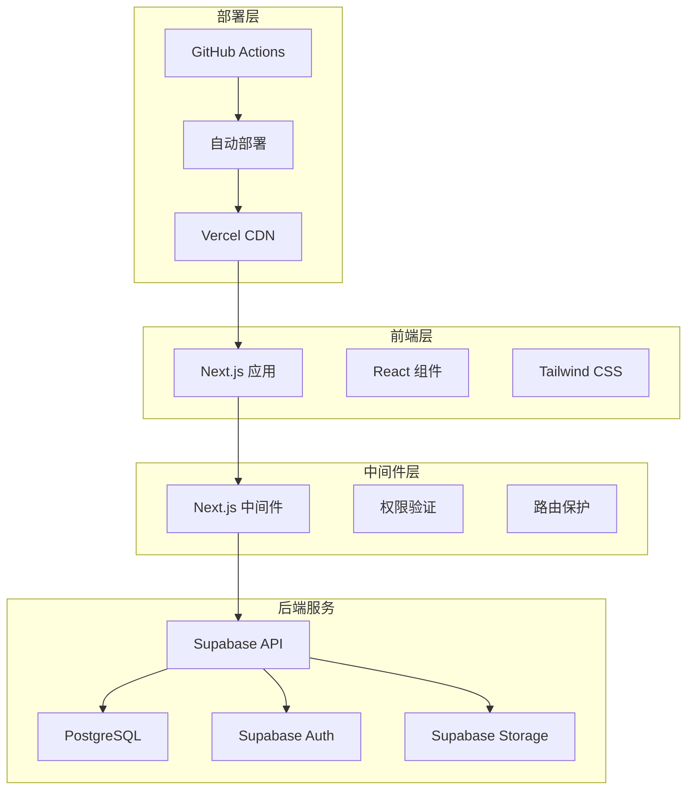
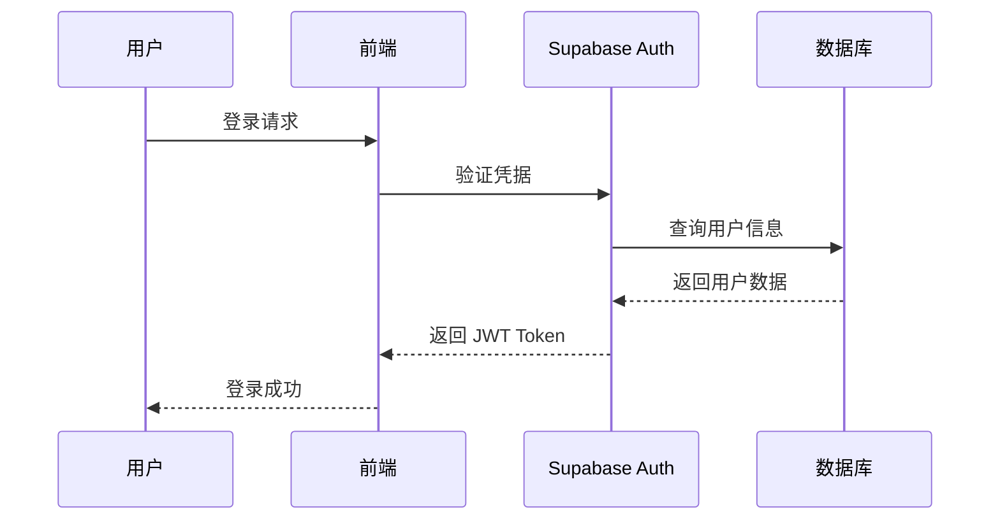
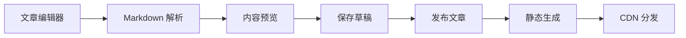
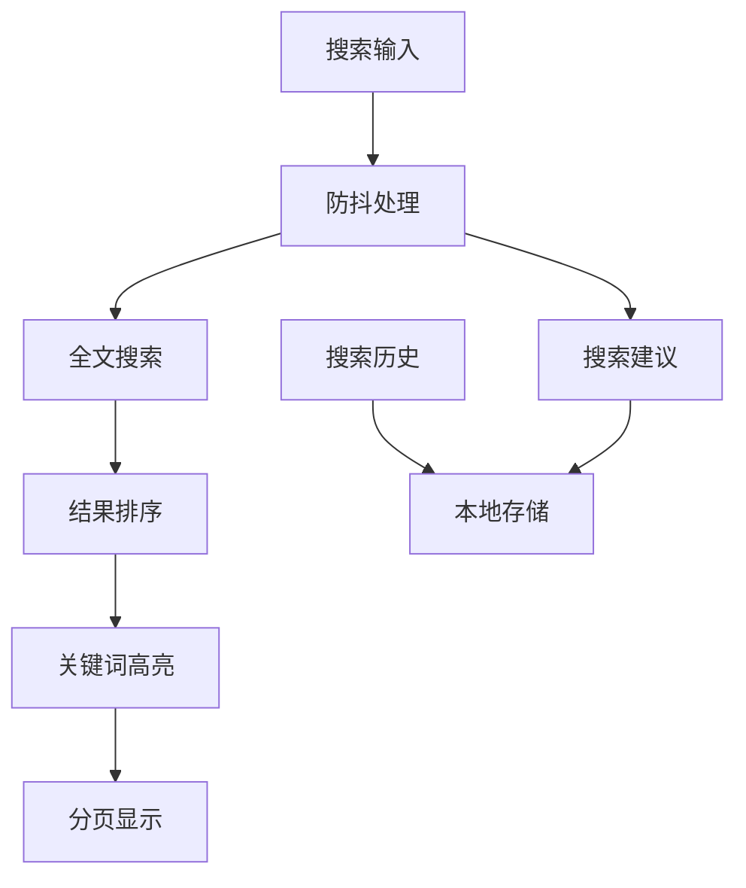
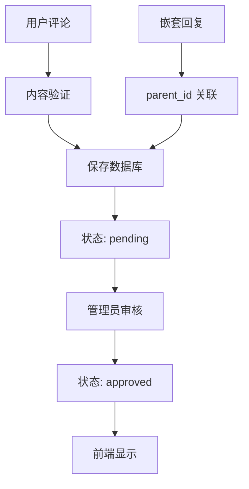
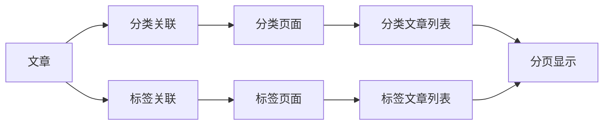

# Buzz Blog 技术文档

## 目录

1. [项目概述](#项目概述)
2. [系统架构](#系统架构)
3. [技术栈详解](#技术栈详解)
4. [数据库设计](#数据库设计)
5. [功能模块详解](#功能模块详解)
6. [API 接口文档](#api-接口文档)
7. [组件架构](#组件架构)
8. [性能优化](#性能优化)
9. [安全机制](#安全机制)
10. [部署指南](#部署指南)
11. [开发指南](#开发指南)
12. [故障排除](#故障排除)

## 项目概述

### 项目背景
Buzz Blog 是一个现代化的全栈博客系统，旨在为内容创作者提供一个功能完整、性能优秀、易于使用的博客平台。项目采用最新的 Web 技术栈，实现了从内容创作到用户交互的完整闭环。

### 核心目标
- **高性能**: 通过静态生成和优化策略实现极致的加载速度
- **易用性**: 提供直观的管理界面和流畅的用户体验
- **可扩展**: 模块化设计，便于功能扩展和定制
- **安全性**: 企业级安全保障，保护用户数据和内容安全

### 项目特色
- 完整的内容管理系统
- 智能搜索和内容发现
- 响应式设计和移动端优化
- 实时评论和用户互动
- SEO 优化和性能监控

## 系统架构

### 整体架构图



### 技术架构分层

#### 1. 表现层 (Presentation Layer)
- **Next.js 14**: 基于 React 的全栈框架，使用 App Router
- **TypeScript**: 提供类型安全和更好的开发体验
- **Tailwind CSS**: 实用优先的 CSS 框架
- **React Components**: 组件化的 UI 构建

#### 2. 业务逻辑层 (Business Logic Layer)
- **Custom Hooks**: 封装业务逻辑的 React Hooks
- **API Functions**: 数据获取和处理函数
- **Middleware**: 请求拦截和权限验证
- **Utils**: 通用工具函数

#### 3. 数据访问层 (Data Access Layer)
- **Supabase Client**: 数据库连接和操作
- **API Routes**: Next.js API 路由
- **Database Queries**: SQL 查询和数据处理
- **File Storage**: 媒体文件存储管理

#### 4. 基础设施层 (Infrastructure Layer)
- **Vercel**: 前端部署和 CDN
- **Supabase**: 后端即服务平台
- **GitHub**: 代码仓库和 CI/CD
- **DNS & SSL**: 域名解析和安全证书

## 技术栈详解

### 前端技术栈

#### Next.js 14
- **App Router**: 新一代路由系统，支持嵌套布局和并行路由
- **Server Components**: 服务端组件，减少客户端 JavaScript
- **Static Generation**: 静态生成，提升页面加载速度
- **Image Optimization**: 自动图片优化和懒加载

#### TypeScript
- **类型安全**: 编译时错误检查，减少运行时错误
- **智能提示**: IDE 支持更好的代码补全和重构
- **接口定义**: 清晰的数据结构定义
- **泛型支持**: 灵活的类型系统

#### Tailwind CSS
- **实用优先**: 原子化 CSS 类，快速构建界面
- **响应式设计**: 内置断点系统，轻松适配各种设备
- **主题定制**: 灵活的主题配置和扩展
- **性能优化**: 自动清除未使用的样式

### 后端技术栈

#### Supabase
- **PostgreSQL**: 强大的关系型数据库
- **Real-time**: 实时数据同步和订阅
- **Auth**: 完整的用户认证系统
- **Storage**: 文件存储和 CDN
- **Edge Functions**: 边缘计算函数

#### 数据库特性
- **Row Level Security**: 行级安全控制
- **JSONB Support**: 灵活的 JSON 数据存储
- **Full-text Search**: 全文搜索功能
- **Triggers & Functions**: 数据库触发器和函数

### 开发工具

#### 代码质量
- **ESLint**: 代码规范检查
- **Prettier**: 代码格式化
- **Husky**: Git hooks 管理
- **TypeScript**: 类型检查

#### 构建工具
- **Next.js Build**: 优化的构建流程
- **Webpack**: 模块打包和优化
- **SWC**: 快速的 JavaScript/TypeScript 编译器
- **PostCSS**: CSS 后处理器## 数据库设
计

### 数据库架构

Buzz Blog 使用 PostgreSQL 作为主数据库，采用关系型数据库设计，确保数据的一致性和完整性。

#### 核心表结构

##### 1. users 表 - 用户信息
```sql
CREATE TABLE users (
  id UUID DEFAULT uuid_generate_v4() PRIMARY KEY,
  email VARCHAR(255) UNIQUE NOT NULL,
  username VARCHAR(50) UNIQUE,
  avatar_url TEXT,
  bio TEXT,
  role VARCHAR(20) DEFAULT 'user',
  created_at TIMESTAMP DEFAULT CURRENT_TIMESTAMP,
  updated_at TIMESTAMP DEFAULT CURRENT_TIMESTAMP,
  last_login TIMESTAMP
);
```

**字段说明:**
- `id`: 用户唯一标识符 (UUID)
- `email`: 用户邮箱地址，用于登录
- `username`: 用户名，显示名称
- `avatar_url`: 头像图片 URL
- `bio`: 用户个人简介
- `role`: 用户角色 (admin/editor/user)
- `created_at`: 创建时间
- `updated_at`: 更新时间
- `last_login`: 最后登录时间

##### 2. categories 表 - 文章分类
```sql
CREATE TABLE categories (
  id UUID DEFAULT uuid_generate_v4() PRIMARY KEY,
  name VARCHAR(100) NOT NULL,
  slug VARCHAR(100) UNIQUE NOT NULL,
  description TEXT,
  created_at TIMESTAMP DEFAULT CURRENT_TIMESTAMP
);
```

**字段说明:**
- `id`: 分类唯一标识符
- `name`: 分类名称
- `slug`: URL 友好的分类标识
- `description`: 分类描述
- `created_at`: 创建时间

##### 3. tags 表 - 文章标签
```sql
CREATE TABLE tags (
  id UUID DEFAULT uuid_generate_v4() PRIMARY KEY,
  name VARCHAR(50) NOT NULL,
  slug VARCHAR(50) UNIQUE NOT NULL,
  created_at TIMESTAMP DEFAULT CURRENT_TIMESTAMP
);
```

##### 4. posts 表 - 文章内容
```sql
CREATE TABLE posts (
  id UUID DEFAULT uuid_generate_v4() PRIMARY KEY,
  title VARCHAR(255) NOT NULL,
  slug VARCHAR(255) UNIQUE NOT NULL,
  content TEXT NOT NULL,
  excerpt TEXT,
  cover_image_url TEXT,
  author_id UUID REFERENCES users(id),
  category_id UUID REFERENCES categories(id),
  status VARCHAR(20) DEFAULT 'draft',
  view_count INTEGER DEFAULT 0,
  created_at TIMESTAMP DEFAULT CURRENT_TIMESTAMP,
  updated_at TIMESTAMP DEFAULT CURRENT_TIMESTAMP,
  published_at TIMESTAMP
);
```

**字段说明:**
- `status`: 文章状态 (draft/published/archived)
- `view_count`: 阅读次数
- `published_at`: 发布时间

##### 5. post_tags 表 - 文章标签关联
```sql
CREATE TABLE post_tags (
  post_id UUID REFERENCES posts(id) ON DELETE CASCADE,
  tag_id UUID REFERENCES tags(id) ON DELETE CASCADE,
  PRIMARY KEY (post_id, tag_id)
);
```

##### 6. comments 表 - 评论系统
```sql
CREATE TABLE comments (
  id UUID DEFAULT uuid_generate_v4() PRIMARY KEY,
  content TEXT NOT NULL,
  post_id UUID REFERENCES posts(id) ON DELETE CASCADE,
  author_id UUID REFERENCES users(id),
  parent_id UUID REFERENCES comments(id) ON DELETE CASCADE,
  status VARCHAR(20) DEFAULT 'pending',
  created_at TIMESTAMP DEFAULT CURRENT_TIMESTAMP,
  updated_at TIMESTAMP DEFAULT CURRENT_TIMESTAMP
);
```

**字段说明:**
- `parent_id`: 父评论 ID，支持嵌套回复
- `status`: 评论状态 (pending/approved/spam)

### 数据库索引优化

```sql
-- 性能优化索引
CREATE INDEX idx_posts_created_at ON posts(created_at DESC);
CREATE INDEX idx_posts_status ON posts(status);
CREATE INDEX idx_posts_author_id ON posts(author_id);
CREATE INDEX idx_posts_category_id ON posts(category_id);
CREATE INDEX idx_comments_post_id ON comments(post_id);
CREATE INDEX idx_comments_status ON comments(status);
CREATE INDEX idx_comments_created_at ON comments(created_at);

-- 全文搜索索引
CREATE INDEX idx_posts_search ON posts USING gin(to_tsvector('english', title || ' ' || content));
```

### 行级安全策略 (RLS)

Supabase 的行级安全策略确保数据访问的安全性：

```sql
-- 启用 RLS
ALTER TABLE posts ENABLE ROW LEVEL SECURITY;
ALTER TABLE comments ENABLE ROW LEVEL SECURITY;

-- 文章访问策略
CREATE POLICY "Public posts are viewable by everyone" ON posts
  FOR SELECT USING (status = 'published');

CREATE POLICY "Users can insert their own posts" ON posts
  FOR INSERT WITH CHECK (auth.uid() = author_id);

-- 评论访问策略
CREATE POLICY "Comments are viewable by everyone" ON comments
  FOR SELECT USING (status = 'approved');

CREATE POLICY "Users can insert their own comments" ON comments
  FOR INSERT WITH CHECK (auth.uid() = author_id);
```

## 功能模块详解

### 1. 用户认证系统

#### 认证流程


#### 核心功能实现

**1. 邮箱密码登录**
```typescript
// lib/auth.ts
export async function login(email: string, password: string) {
  const { data, error } = await supabase.auth.signInWithPassword({
    email,
    password,
  });

  if (error) throw new Error(error.message);
  
  // 更新最后登录时间
  if (data.user) {
    await updateLastLogin(data.user.id);
  }

  return data;
}
```

**2. 第三方登录**
```typescript
export async function loginWithGitHub() {
  const { data, error } = await supabase.auth.signInWithOAuth({
    provider: 'github',
    options: {
      redirectTo: `${window.location.origin}/auth/callback`
    }
  });

  if (error) throw new Error(error.message);
  return data;
}
```

**3. 权限验证中间件**
```typescript
// middleware.ts
export async function middleware(req: NextRequest) {
  const supabase = createMiddlewareClient({ req, res });
  const { data: { session } } = await supabase.auth.getSession();

  // 保护管理路由
  if (req.nextUrl.pathname.startsWith('/admin')) {
    if (!session) {
      return NextResponse.redirect(new URL('/auth/login', req.url));
    }

    // 检查用户权限
    const { data: userProfile } = await supabase
      .from('users')
      .select('role')
      .eq('id', session.user.id)
      .single();

    if (userProfile?.role !== 'admin' && userProfile?.role !== 'editor') {
      return new NextResponse('Forbidden', { status: 403 });
    }
  }

  return NextResponse.next();
}
```

### 2. 内容管理系统

#### 文章管理架构


#### 核心组件实现

**1. Markdown 编辑器**
```typescript
// components/admin/PostEditor.tsx
export default function PostEditor({ post, isEdit = false }: PostEditorProps) {
  const [formData, setFormData] = useState({
    title: post?.title || '',
    content: post?.content || '',
    status: post?.status || 'draft'
  });

  const [previewHtml, setPreviewHtml] = useState('');

  const handlePreview = async () => {
    const html = await markdownToHtml(formData.content);
    setPreviewHtml(html);
  };

  return (
    <div className="grid grid-cols-2 gap-4">
      {/* 编辑区域 */}
      <div>
        <textarea
          value={formData.content}
          onChange={(e) => setFormData(prev => ({
            ...prev,
            content: e.target.value
          }))}
          className="w-full h-96 font-mono"
        />
      </div>
      
      {/* 预览区域 */}
      <div className="prose">
        <div dangerouslySetInnerHTML={{ __html: previewHtml }} />
      </div>
    </div>
  );
}
```

**2. 文章 CRUD 操作**
```typescript
// lib/admin-posts.ts
export async function createPost(postData: CreatePostData) {
  const { data, error } = await supabase
    .from('posts')
    .insert([{
      ...postData,
      created_at: new Date().toISOString(),
      updated_at: new Date().toISOString(),
      published_at: postData.status === 'published' ? new Date().toISOString() : null,
    }])
    .select()
    .single();

  if (error) throw new Error(error.message);
  return data;
}

export async function updatePost(id: string, postData: Partial<PostData>) {
  const { data, error } = await supabase
    .from('posts')
    .update({
      ...postData,
      updated_at: new Date().toISOString(),
    })
    .eq('id', id)
    .select()
    .single();

  if (error) throw new Error(error.message);
  return data;
}
```

### 3. 搜索系统

#### 搜索架构


#### 搜索功能实现

**1. 全文搜索**
```typescript
// lib/search.ts
export async function searchPosts(params: SearchParams): Promise<SearchResult> {
  const { query, category, sortBy = 'relevance', page = 1, limit = 10 } = params;

  let searchQuery = supabase
    .from('posts')
    .select(`
      id, title, slug, excerpt, content, created_at, view_count,
      users(username), categories(name)
    `, { count: 'exact' })
    .eq('status', 'published');

  // 全文搜索
  if (query) {
    searchQuery = searchQuery.or(
      `title.ilike.%${query}%,excerpt.ilike.%${query}%,content.ilike.%${query}%`
    );
  }

  // 分类筛选
  if (category) {
    searchQuery = searchQuery.eq('categories.slug', category);
  }

  // 排序
  switch (sortBy) {
    case 'date':
      searchQuery = searchQuery.order('created_at', { ascending: false });
      break;
    case 'views':
      searchQuery = searchQuery.order('view_count', { ascending: false });
      break;
  }

  // 分页
  const from = (page - 1) * limit;
  searchQuery = searchQuery.range(from, from + limit - 1);

  const { data, count, error } = await searchQuery;
  if (error) throw new Error(error.message);

  return {
    posts: data.map(post => ({
      ...post,
      highlight: generateHighlight(post, query)
    })),
    total: count || 0
  };
}
```

**2. 关键词高亮**
```typescript
function generateHighlight(post: any, searchTerm: string) {
  const highlight: any = {};
  const term = searchTerm.toLowerCase();

  // 高亮标题
  if (post.title.toLowerCase().includes(term)) {
    highlight.title = highlightText(post.title, searchTerm);
  }

  // 高亮内容片段
  if (post.content.toLowerCase().includes(term)) {
    highlight.content = extractAndHighlightContent(post.content, searchTerm);
  }

  return highlight;
}

function highlightText(text: string, searchTerm: string): string {
  const regex = new RegExp(`(${escapeRegExp(searchTerm)})`, 'gi');
  return text.replace(regex, '<mark class="bg-yellow-200">$1</mark>');
}
```

**3. 搜索建议**
```typescript
export async function getSearchSuggestions(query: string): Promise<string[]> {
  const { data, error } = await supabase
    .from('posts')
    .select('title')
    .eq('status', 'published')
    .ilike('title', `%${query}%`)
    .limit(5);

  if (error) return [];

  return data.map(post => post.title);
}
```

### 4. 评论系统

#### 评论架构


#### 评论功能实现

**1. 评论提交**
```typescript
// lib/comments.ts
export async function submitComment(
  postId: string,
  authorId: string,
  content: string,
  parentId?: string
) {
  const { data, error } = await supabase
    .from('comments')
    .insert([{
      post_id: postId,
      author_id: authorId,
      content: content,
      parent_id: parentId || null,
      status: 'pending'
    }])
    .select()
    .single();

  if (error) throw new Error(error.message);
  return data;
}
```

**2. 嵌套评论获取**
```typescript
export async function getCommentsByPostId(postId: string): Promise<Comment[]> {
  // 获取顶级评论
  const { data: topComments, error } = await supabase
    .from('comments')
    .select(`
      id, content, created_at, author_id,
      users(username)
    `)
    .eq('post_id', postId)
    .is('parent_id', null)
    .eq('status', 'approved')
    .order('created_at', { ascending: false });

  if (error) throw new Error(error.message);

  // 为每个顶级评论获取回复
  const commentsWithReplies = await Promise.all(
    topComments.map(async (comment) => {
      const { data: replies } = await supabase
        .from('comments')
        .select(`
          id, content, created_at, author_id,
          users(username)
        `)
        .eq('parent_id', comment.id)
        .eq('status', 'approved')
        .order('created_at', { ascending: true });

      return {
        ...comment,
        replies: replies || []
      };
    })
  );

  return commentsWithReplies;
}
```

### 5. 分类标签系统

#### 分类标签架构


#### 实现细节

**1. 分类页面生成**
```typescript
// app/categories/[slug]/page.tsx
export async function generateStaticParams() {
  const { data: categories } = await supabase
    .from('categories')
    .select('slug');

  return categories?.map((category) => ({
    slug: category.slug,
  })) || [];
}

export default async function CategoryPage({ params, searchParams }) {
  const category = await getCategoryBySlug(params.slug);
  const { posts, total } = await getCategoryPosts(params.slug, page, 10, sortBy);
  
  return (
    <div>
      <CategoryHeader category={category} />
      <CategoryPosts posts={posts} total={total} />
    </div>
  );
}
```

**2. 标签云实现**
```typescript
// components/RelatedTags.tsx
export default function RelatedTags({ tags }) {
  return (
    <div className="flex flex-wrap gap-2">
      {tags.map((tag) => {
        const size = Math.min(Math.max(tag.post_count, 1), 5);
        const sizeClasses = {
          1: 'text-xs',
          2: 'text-sm', 
          3: 'text-base',
          4: 'text-lg',
          5: 'text-xl'
        };
        
        return (
          <Link
            key={tag.id}
            href={`/tags/${tag.slug}`}
            className={`tag ${sizeClasses[size]}`}
            style={{ 
              opacity: 0.6 + (size * 0.1),
              fontWeight: 300 + (size * 100)
            }}
          >
            #{tag.name}
          </Link>
        );
      })}
    </div>
  );
}
```## API
 接口文档

### 认证相关 API

#### 用户登录
```typescript
POST /api/auth/login
Content-Type: application/json

{
  "email": "user@example.com",
  "password": "password123"
}

Response:
{
  "success": true,
  "user": {
    "id": "uuid",
    "email": "user@example.com",
    "username": "username"
  },
  "token": "jwt_token"
}
```

#### 用户注册
```typescript
POST /api/auth/register
Content-Type: application/json

{
  "email": "user@example.com",
  "password": "password123",
  "username": "username"
}
```

#### 第三方登录
```typescript
GET /api/auth/oauth/github
GET /api/auth/oauth/google

Response: 重定向到第三方授权页面
```

### 文章相关 API

#### 获取文章列表
```typescript
GET /api/posts?page=1&limit=10&category=tech&status=published

Response:
{
  "posts": [
    {
      "id": "uuid",
      "title": "文章标题",
      "slug": "article-slug",
      "excerpt": "文章摘要",
      "author": "作者名",
      "category": "分类名",
      "created_at": "2023-01-01T00:00:00Z",
      "view_count": 100
    }
  ],
  "total": 50,
  "page": 1,
  "limit": 10
}
```

#### 获取文章详情
```typescript
GET /api/posts/[slug]

Response:
{
  "id": "uuid",
  "title": "文章标题",
  "content": "Markdown 内容",
  "author": "作者名",
  "category": "分类名",
  "tags": ["标签1", "标签2"],
  "created_at": "2023-01-01T00:00:00Z",
  "updated_at": "2023-01-01T00:00:00Z"
}
```

#### 创建文章 (需要认证)
```typescript
POST /api/admin/posts
Authorization: Bearer jwt_token
Content-Type: application/json

{
  "title": "文章标题",
  "content": "Markdown 内容",
  "excerpt": "文章摘要",
  "category_id": "uuid",
  "tag_ids": ["uuid1", "uuid2"],
  "status": "draft" | "published"
}
```

### 搜索相关 API

#### 全文搜索
```typescript
GET /api/search?q=关键词&category=tech&sort=relevance&page=1

Response:
{
  "posts": [
    {
      "id": "uuid",
      "title": "文章标题",
      "excerpt": "文章摘要",
      "highlight": {
        "title": "高亮的<mark>标题</mark>",
        "content": "高亮的<mark>内容</mark>片段"
      }
    }
  ],
  "total": 25,
  "suggestions": ["建议词1", "建议词2"]
}
```

#### 搜索建议
```typescript
GET /api/search/suggestions?q=关键

Response:
{
  "suggestions": [
    "关键词1",
    "关键词2", 
    "关键词3"
  ]
}
```

### 评论相关 API

#### 获取文章评论
```typescript
GET /api/posts/[slug]/comments

Response:
{
  "comments": [
    {
      "id": "uuid",
      "content": "评论内容",
      "author": "评论者",
      "created_at": "2023-01-01T00:00:00Z",
      "replies": [
        {
          "id": "uuid",
          "content": "回复内容",
          "author": "回复者",
          "created_at": "2023-01-01T00:00:00Z"
        }
      ]
    }
  ]
}
```

#### 提交评论 (需要认证)
```typescript
POST /api/posts/[slug]/comments
Authorization: Bearer jwt_token
Content-Type: application/json

{
  "content": "评论内容",
  "parent_id": "uuid" // 可选，回复评论时使用
}
```

### 管理后台 API

#### 获取统计数据
```typescript
GET /api/admin/stats
Authorization: Bearer jwt_token

Response:
{
  "totalPosts": 100,
  "publishedPosts": 80,
  "draftPosts": 20,
  "totalComments": 500,
  "pendingComments": 10,
  "totalUsers": 50
}
```

#### 批量操作文章
```typescript
POST /api/admin/posts/batch
Authorization: Bearer jwt_token
Content-Type: application/json

{
  "action": "publish" | "draft" | "delete",
  "post_ids": ["uuid1", "uuid2", "uuid3"]
}
```

## 组件架构

### 组件层次结构

```
app/
├── layout.tsx                 # 根布局组件
├── page.tsx                   # 首页组件
├── admin/
│   ├── layout.tsx            # 管理后台布局
│   ├── page.tsx              # 仪表板页面
│   ├── posts/
│   │   ├── page.tsx          # 文章列表页面
│   │   ├── new/page.tsx      # 新建文章页面
│   │   └── edit/[id]/page.tsx # 编辑文章页面
│   ├── categories/page.tsx    # 分类管理页面
│   ├── tags/page.tsx         # 标签管理页面
│   └── comments/page.tsx     # 评论管理页面
├── posts/[slug]/page.tsx     # 文章详情页面
├── categories/[slug]/page.tsx # 分类页面
├── tags/[slug]/page.tsx      # 标签页面
└── search/page.tsx           # 搜索页面

components/
├── ui/                       # 通用 UI 组件
│   ├── Button.tsx
│   ├── Input.tsx
│   ├── Modal.tsx
│   └── Loading.tsx
├── admin/                    # 管理后台组件
│   ├── AdminLayout.tsx       # 管理后台布局
│   ├── AdminRoute.tsx        # 路由保护组件
│   ├── PostEditor.tsx        # 文章编辑器
│   ├── PostsList.tsx         # 文章列表
│   ├── DashboardStats.tsx    # 仪表板统计
│   └── ErrorBoundary.tsx     # 错误边界
├── SearchBox.tsx             # 搜索框组件
├── SearchResults.tsx         # 搜索结果组件
├── CategoryHeader.tsx        # 分类头部组件
├── TagHeader.tsx             # 标签头部组件
├── LazyImage.tsx             # 懒加载图片组件
└── BackToTop.tsx             # 回到顶部组件
```

### 核心组件详解

#### 1. AdminLayout 组件
管理后台的主布局组件，提供统一的导航和权限控制。

```typescript
// components/admin/AdminLayout.tsx
export default function AdminLayout({ children }: AdminLayoutProps) {
  const [sidebarOpen, setSidebarOpen] = useState(false);
  const [user, setUser] = useState<any>(null);
  const pathname = usePathname();

  useEffect(() => {
    async function loadUserInfo() {
      const currentUser = await getCurrentUser();
      if (currentUser) {
        setUser(currentUser);
      }
    }
    loadUserInfo();
  }, []);

  return (
    <div className="min-h-screen bg-gray-50">
      {/* 侧边栏 */}
      <Sidebar 
        open={sidebarOpen} 
        onClose={() => setSidebarOpen(false)}
        currentPath={pathname}
      />
      
      {/* 主内容区域 */}
      <div className="lg:pl-64">
        <Header 
          onMenuClick={() => setSidebarOpen(true)}
          user={user}
        />
        
        <main className="py-6">
          <div className="px-4 sm:px-6 lg:px-8">
            <ErrorBoundary>
              {children}
            </ErrorBoundary>
          </div>
        </main>
      </div>
    </div>
  );
}
```

#### 2. PostEditor 组件
Markdown 文章编辑器，支持实时预览和自动保存。

```typescript
// components/admin/PostEditor.tsx
export default function PostEditor({ post, isEdit = false }: PostEditorProps) {
  const [formData, setFormData] = useState({
    title: post?.title || '',
    content: post?.content || '',
    excerpt: post?.excerpt || '',
    category_id: post?.category_id || '',
    status: post?.status || 'draft'
  });

  const [previewMode, setPreviewMode] = useState(false);
  const [previewHtml, setPreviewHtml] = useState('');

  // 自动保存功能
  const debouncedSave = useCallback(
    debounce(async (data) => {
      if (isEdit && post) {
        await updatePost(post.id, data);
      }
    }, 2000),
    [isEdit, post]
  );

  useEffect(() => {
    if (formData.title || formData.content) {
      debouncedSave(formData);
    }
  }, [formData, debouncedSave]);

  const handlePreview = async () => {
    if (!previewMode) {
      const html = await markdownToHtml(formData.content);
      setPreviewHtml(html);
    }
    setPreviewMode(!previewMode);
  };

  return (
    <div className="bg-white shadow rounded-lg">
      <div className="px-6 py-4 border-b">
        <div className="flex items-center justify-between">
          <h2 className="text-lg font-medium">
            {isEdit ? '编辑文章' : '创建文章'}
          </h2>
          <div className="flex space-x-3">
            <button onClick={handlePreview}>
              {previewMode ? '编辑' : '预览'}
            </button>
            <button onClick={() => handleSubmit('draft')}>
              保存草稿
            </button>
            <button onClick={() => handleSubmit('published')}>
              发布文章
            </button>
          </div>
        </div>
      </div>

      <div className="p-6">
        {!previewMode ? (
          <EditMode 
            formData={formData}
            onChange={setFormData}
          />
        ) : (
          <PreviewMode html={previewHtml} />
        )}
      </div>
    </div>
  );
}
```

#### 3. SearchBox 组件
智能搜索框，支持实时建议和搜索历史。

```typescript
// components/SearchBox.tsx
export default function SearchBox({ onSearch, showSuggestions = false }) {
  const [query, setQuery] = useState('');
  const [suggestions, setSuggestions] = useState<string[]>([]);
  const [showDropdown, setShowDropdown] = useState(false);
  
  const debouncedQuery = useDebounce(query, 300);

  useEffect(() => {
    if (showSuggestions && debouncedQuery && debouncedQuery.length >= 2) {
      loadSuggestions(debouncedQuery);
    }
  }, [debouncedQuery, showSuggestions]);

  const loadSuggestions = async (searchQuery: string) => {
    const results = await getSearchSuggestions(searchQuery);
    setSuggestions(results);
    setShowDropdown(true);
  };

  const handleSubmit = (e: React.FormEvent) => {
    e.preventDefault();
    if (query.trim()) {
      SearchHistory.addToHistory(query.trim());
      onSearch(query.trim());
      setShowDropdown(false);
    }
  };

  return (
    <div className="relative">
      <form onSubmit={handleSubmit}>
        <input
          type="text"
          value={query}
          onChange={(e) => setQuery(e.target.value)}
          onFocus={() => setShowDropdown(true)}
          placeholder="搜索文章..."
          className="w-full px-4 py-2 border rounded-lg"
        />
      </form>

      {showSuggestions && showDropdown && (
        <SuggestionDropdown
          suggestions={suggestions}
          onSelect={(suggestion) => {
            setQuery(suggestion);
            onSearch(suggestion);
            setShowDropdown(false);
          }}
        />
      )}
    </div>
  );
}
```

#### 4. LazyImage 组件
高性能图片懒加载组件，支持占位符和渐进加载。

```typescript
// components/LazyImage.tsx
export default function LazyImage({ src, alt, className, width, height }) {
  const [isLoaded, setIsLoaded] = useState(false);
  const [isInView, setIsInView] = useState(false);
  const [hasError, setHasError] = useState(false);
  const imgRef = useRef<HTMLImageElement>(null);

  useEffect(() => {
    const observer = new IntersectionObserver(
      (entries) => {
        entries.forEach((entry) => {
          if (entry.isIntersecting) {
            setIsInView(true);
            observer.disconnect();
          }
        });
      },
      { rootMargin: '50px', threshold: 0.1 }
    );

    if (imgRef.current) {
      observer.observe(imgRef.current);
    }

    return () => observer.disconnect();
  }, []);

  return (
    <div ref={imgRef} className={`relative ${className}`}>
      {/* 占位符 */}
      {!isInView && (
        <div className="absolute inset-0 bg-gray-100 animate-pulse" />
      )}

      {/* 实际图片 */}
      {isInView && (
         setIsLoaded(true)}
          onError={() => setHasError(true)}
          className={`transition-opacity duration-300 ${
            isLoaded ? 'opacity-100' : 'opacity-0'
          }`}
          loading="lazy"
        />
      )}

      {/* 加载指示器 */}
      {isInView && !isLoaded && !hasError && (
        <div className="absolute inset-0 flex items-center justify-center">
          <div className="animate-spin rounded-full h-6 w-6 border-b-2 border-blue-600" />
        </div>
      )}
    </div>
  );
}
```

### 状态管理

#### 1. React Context
用于全局状态管理，如用户认证状态、主题设置等。

```typescript
// contexts/AuthContext.tsx
const AuthContext = createContext<AuthContextType | undefined>(undefined);

export function AuthProvider({ children }: { children: React.ReactNode }) {
  const [user, setUser] = useState<User | null>(null);
  const [loading, setLoading] = useState(true);

  useEffect(() => {
    const { data: { subscription } } = supabase.auth.onAuthStateChange(
      async (event, session) => {
        if (session?.user) {
          const userProfile = await getUserProfile(session.user.id);
          setUser(userProfile);
        } else {
          setUser(null);
        }
        setLoading(false);
      }
    );

    return () => subscription.unsubscribe();
  }, []);

  const value = {
    user,
    loading,
    login,
    logout,
    register
  };

  return (
    <AuthContext.Provider value={value}>
      {children}
    </AuthContext.Provider>
  );
}
```

#### 2. Custom Hooks
封装业务逻辑的自定义 Hooks。

```typescript
// hooks/useAuth.ts
export function useAuth() {
  const context = useContext(AuthContext);
  if (context === undefined) {
    throw new Error('useAuth must be used within an AuthProvider');
  }
  return context;
}

// hooks/useDebounce.ts
export function useDebounce<T>(value: T, delay: number): T {
  const [debouncedValue, setDebouncedValue] = useState<T>(value);

  useEffect(() => {
    const handler = setTimeout(() => {
      setDebouncedValue(value);
    }, delay);

    return () => clearTimeout(handler);
  }, [value, delay]);

  return debouncedValue;
}

// hooks/usePagination.ts
export function usePagination(totalItems: number, itemsPerPage: number = 10) {
  const [currentPage, setCurrentPage] = useState(1);
  
  const totalPages = Math.ceil(totalItems / itemsPerPage);
  const startIndex = (currentPage - 1) * itemsPerPage;
  const endIndex = startIndex + itemsPerPage;

  const goToPage = (page: number) => {
    setCurrentPage(Math.max(1, Math.min(page, totalPages)));
  };

  return {
    currentPage,
    totalPages,
    startIndex,
    endIndex,
    goToPage,
    hasNext: currentPage < totalPages,
    hasPrev: currentPage > 1
  };
}
```## 
性能优化

### 前端性能优化

#### 1. 静态生成 (SSG)
Next.js 的静态生成功能，在构建时预渲染页面，大幅提升加载速度。

```typescript
// app/posts/[slug]/page.tsx
export async function generateStaticParams() {
  const { data: posts } = await supabase
    .from('posts')
    .select('slug')
    .eq('status', 'published')
    .limit(100);

  return posts?.map((post) => ({
    slug: post.slug,
  })) || [];
}

export default async function PostPage({ params }) {
  // 页面在构建时生成，运行时直接返回静态 HTML
  const post = await getPost(params.slug);
  return <PostContent post={post} />;
}
```

#### 2. 增量静态再生 (ISR)
允许在运行时更新静态页面，平衡性能和内容新鲜度。

```typescript
// next.config.js
module.exports = {
  experimental: {
    // 启用 ISR
    isrMemoryCacheSize: 0,
  },
  
  // 重新验证间隔
  async rewrites() {
    return [
      {
        source: '/posts/:slug',
        destination: '/posts/:slug',
        has: [
          {
            type: 'header',
            key: 'x-revalidate',
            value: '(?<revalidate>.*)',
          },
        ],
      },
    ];
  },
};

// 页面级别的 ISR 配置
export const revalidate = 3600; // 1小时重新验证
```

#### 3. 图片优化
自动图片优化和懒加载，减少带宽使用和提升加载速度。

```typescript
// next.config.js
module.exports = {
  images: {
    domains: ['picsum.photos', 'images.unsplash.com'],
    formats: ['image/webp', 'image/avif'],
    deviceSizes: [640, 750, 828, 1080, 1200, 1920, 2048, 3840],
    imageSizes: [16, 32, 48, 64, 96, 128, 256, 384],
    minimumCacheTTL: 60 * 60 * 24 * 30, // 30天缓存
  },
};

// 使用优化的图片组件
import Image from 'next/image';

<Image
  src="/hero-image.jpg"
  alt="Hero Image"
  width={1200}
  height={600}
  priority // 首屏图片优先加载
  placeholder="blur"
  blurDataURL="data:image/jpeg;base64,..."
/>
```

#### 4. 代码分割
按路由和组件自动分割代码，减少初始包大小。

```typescript
// 动态导入组件
const AdminPanel = dynamic(() => import('../components/AdminPanel'), {
  loading: () => <Loading />,
  ssr: false // 客户端渲染
});

// 条件加载
const ChartComponent = dynamic(() => import('../components/Chart'), {
  loading: () => <div>Loading chart...</div>
});

function Dashboard() {
  const [showChart, setShowChart] = useState(false);
  
  return (
    <div>
      <h1>Dashboard</h1>
      {showChart && <ChartComponent />}
    </div>
  );
}
```

#### 5. 缓存策略
多层缓存策略，包括浏览器缓存、CDN 缓存和 API 缓存。

```typescript
// next.config.js
module.exports = {
  async headers() {
    return [
      {
        source: '/api/(.*)',
        headers: [
          {
            key: 'Cache-Control',
            value: 'public, max-age=300, s-maxage=300',
          },
        ],
      },
      {
        source: '/(.*\\.(js|css|png|jpg|jpeg|gif|webp|svg|ico))',
        headers: [
          {
            key: 'Cache-Control',
            value: 'public, max-age=31536000, immutable',
          },
        ],
      },
    ];
  },
};

// API 级别缓存
export async function GET(request: Request) {
  const { searchParams } = new URL(request.url);
  const cacheKey = `posts-${searchParams.toString()}`;
  
  // 检查缓存
  const cached = await redis.get(cacheKey);
  if (cached) {
    return new Response(cached, {
      headers: {
        'Content-Type': 'application/json',
        'Cache-Control': 'public, max-age=300',
      },
    });
  }
  
  // 获取数据并缓存
  const data = await getPosts();
  await redis.setex(cacheKey, 300, JSON.stringify(data));
  
  return Response.json(data);
}
```

### 数据库性能优化

#### 1. 索引优化
为常用查询字段创建索引，提升查询性能。

```sql
-- 文章查询索引
CREATE INDEX CONCURRENTLY idx_posts_status_created_at 
ON posts(status, created_at DESC);

-- 全文搜索索引
CREATE INDEX CONCURRENTLY idx_posts_search 
ON posts USING gin(to_tsvector('english', title || ' ' || content));

-- 复合索引
CREATE INDEX CONCURRENTLY idx_posts_author_category 
ON posts(author_id, category_id) WHERE status = 'published';

-- 部分索引
CREATE INDEX CONCURRENTLY idx_posts_published 
ON posts(created_at DESC) WHERE status = 'published';
```

#### 2. 查询优化
优化 SQL 查询，减少数据库负载。

```typescript
// 优化前：N+1 查询问题
async function getPosts() {
  const posts = await supabase.from('posts').select('*');
  
  for (const post of posts) {
    post.author = await supabase
      .from('users')
      .select('username')
      .eq('id', post.author_id)
      .single();
  }
  
  return posts;
}

// 优化后：使用 JOIN 查询
async function getPosts() {
  const { data } = await supabase
    .from('posts')
    .select(`
      *,
      users!inner(username),
      categories(name),
      post_tags(tags(name))
    `)
    .eq('status', 'published')
    .order('created_at', { ascending: false });
    
  return data;
}
```

#### 3. 连接池配置
优化数据库连接池，提升并发处理能力。

```typescript
// supabase 客户端配置
const supabase = createClient(
  process.env.NEXT_PUBLIC_SUPABASE_URL!,
  process.env.NEXT_PUBLIC_SUPABASE_ANON_KEY!,
  {
    db: {
      schema: 'public',
    },
    auth: {
      autoRefreshToken: true,
      persistSession: true,
      detectSessionInUrl: true
    },
    global: {
      headers: {
        'x-application-name': 'buzz-blog',
      },
    },
  }
);
```

### 监控和分析

#### 1. 性能监控
使用 Web Vitals 监控核心性能指标。

```typescript
// lib/analytics.ts
export function reportWebVitals(metric: any) {
  // 发送到分析服务
  if (process.env.NODE_ENV === 'production') {
    gtag('event', metric.name, {
      event_category: 'Web Vitals',
      value: Math.round(metric.value),
      event_label: metric.id,
      non_interaction: true,
    });
  }
}

// app/layout.tsx
import { reportWebVitals } from '../lib/analytics';

export { reportWebVitals };
```

#### 2. 错误监控
集成错误监控服务，及时发现和修复问题。

```typescript
// lib/error-reporting.ts
export function reportError(error: Error, context?: any) {
  if (process.env.NODE_ENV === 'production') {
    // 发送到错误监控服务
    console.error('Application Error:', {
      message: error.message,
      stack: error.stack,
      context,
      timestamp: new Date().toISOString(),
      userAgent: navigator.userAgent,
      url: window.location.href,
    });
  }
}

// components/ErrorBoundary.tsx
class ErrorBoundary extends React.Component {
  componentDidCatch(error: Error, errorInfo: React.ErrorInfo) {
    reportError(error, errorInfo);
  }
  
  render() {
    if (this.state.hasError) {
      return <ErrorFallback />;
    }
    
    return this.props.children;
  }
}
```

## 安全机制

### 认证和授权

#### 1. JWT Token 管理
使用 Supabase Auth 管理 JWT Token，确保安全的用户认证。

```typescript
// lib/auth.ts
export async function getAuthToken(): Promise<string | null> {
  const { data: { session } } = await supabase.auth.getSession();
  return session?.access_token || null;
}

export async function refreshToken(): Promise<void> {
  const { error } = await supabase.auth.refreshSession();
  if (error) {
    throw new Error('Token refresh failed');
  }
}

// 自动刷新 Token
supabase.auth.onAuthStateChange((event, session) => {
  if (event === 'TOKEN_REFRESHED') {
    console.log('Token refreshed successfully');
  }
});
```

#### 2. 权限控制
基于角色的访问控制 (RBAC)，确保用户只能访问授权的资源。

```typescript
// lib/permissions.ts
export enum UserRole {
  ADMIN = 'admin',
  EDITOR = 'editor', 
  USER = 'user'
}

export function hasPermission(userRole: UserRole, requiredRole: UserRole): boolean {
  const roleHierarchy = {
    [UserRole.USER]: 0,
    [UserRole.EDITOR]: 1,
    [UserRole.ADMIN]: 2
  };
  
  return roleHierarchy[userRole] >= roleHierarchy[requiredRole];
}

export async function requirePermission(requiredRole: UserRole) {
  const user = await getCurrentUser();
  if (!user || !hasPermission(user.role, requiredRole)) {
    throw new Error('Insufficient permissions');
  }
}
```

#### 3. 中间件保护
Next.js 中间件保护敏感路由。

```typescript
// middleware.ts
export async function middleware(request: NextRequest) {
  const supabase = createMiddlewareClient({ req: request, res: NextResponse.next() });
  
  // 检查认证状态
  const { data: { session } } = await supabase.auth.getSession();
  
  // 保护管理路由
  if (request.nextUrl.pathname.startsWith('/admin')) {
    if (!session) {
      return NextResponse.redirect(new URL('/auth/login', request.url));
    }
    
    // 检查用户权限
    const { data: user } = await supabase
      .from('users')
      .select('role')
      .eq('id', session.user.id)
      .single();
      
    if (!user || !['admin', 'editor'].includes(user.role)) {
      return new NextResponse('Forbidden', { status: 403 });
    }
  }
  
  return NextResponse.next();
}

export const config = {
  matcher: [
    '/((?!_next/static|_next/image|favicon.ico|.*\\.(?:svg|png|jpg|jpeg|gif|webp)$).*)',
  ],
};
```

### 数据安全

#### 1. 行级安全 (RLS)
Supabase 的行级安全策略，确保数据访问的细粒度控制。

```sql
-- 启用 RLS
ALTER TABLE posts ENABLE ROW LEVEL SECURITY;
ALTER TABLE comments ENABLE ROW LEVEL SECURITY;

-- 文章访问策略
CREATE POLICY "Anyone can view published posts" ON posts
  FOR SELECT USING (status = 'published');

CREATE POLICY "Authors can view their own posts" ON posts
  FOR SELECT USING (auth.uid() = author_id);

CREATE POLICY "Authors can update their own posts" ON posts
  FOR UPDATE USING (auth.uid() = author_id);

CREATE POLICY "Admins can do anything" ON posts
  FOR ALL USING (
    EXISTS (
      SELECT 1 FROM users 
      WHERE id = auth.uid() 
      AND role IN ('admin', 'editor')
    )
  );

-- 评论访问策略
CREATE POLICY "Anyone can view approved comments" ON comments
  FOR SELECT USING (status = 'approved');

CREATE POLICY "Users can insert their own comments" ON comments
  FOR INSERT WITH CHECK (auth.uid() = author_id);

CREATE POLICY "Users can update their own comments" ON comments
  FOR UPDATE USING (auth.uid() = author_id);
```

#### 2. 输入验证和清洗
防止 XSS 攻击和 SQL 注入。

```typescript
// lib/validation.ts
import DOMPurify from 'dompurify';
import { z } from 'zod';

// 输入验证 Schema
export const PostSchema = z.object({
  title: z.string().min(1).max(255),
  content: z.string().min(1),
  excerpt: z.string().max(500).optional(),
  category_id: z.string().uuid().optional(),
  status: z.enum(['draft', 'published', 'archived'])
});

export const CommentSchema = z.object({
  content: z.string().min(1).max(1000),
  post_id: z.string().uuid(),
  parent_id: z.string().uuid().optional()
});

// HTML 内容清洗
export function sanitizeHtml(html: string): string {
  return DOMPurify.sanitize(html, {
    ALLOWED_TAGS: ['p', 'br', 'strong', 'em', 'u', 'h1', 'h2', 'h3', 'h4', 'h5', 'h6', 'ul', 'ol', 'li', 'a', 'img', 'blockquote', 'code', 'pre'],
    ALLOWED_ATTR: ['href', 'src', 'alt', 'title', 'class']
  });
}

// API 输入验证
export async function validateInput<T>(schema: z.ZodSchema<T>, data: unknown): Promise<T> {
  try {
    return schema.parse(data);
  } catch (error) {
    if (error instanceof z.ZodError) {
      throw new Error(`Validation failed: ${error.errors.map(e => e.message).join(', ')}`);
    }
    throw error;
  }
}
```

#### 3. CSRF 保护
防止跨站请求伪造攻击。

```typescript
// lib/csrf.ts
import { randomBytes } from 'crypto';

export function generateCSRFToken(): string {
  return randomBytes(32).toString('hex');
}

export function validateCSRFToken(token: string, sessionToken: string): boolean {
  return token === sessionToken;
}

// API 路由中的 CSRF 验证
export async function POST(request: Request) {
  const csrfToken = request.headers.get('x-csrf-token');
  const sessionToken = await getSessionCSRFToken();
  
  if (!csrfToken || !validateCSRFToken(csrfToken, sessionToken)) {
    return new Response('CSRF token validation failed', { status: 403 });
  }
  
  // 处理请求...
}
```

### API 安全

#### 1. 速率限制
防止 API 滥用和 DDoS 攻击。

```typescript
// lib/rate-limit.ts
import { LRUCache } from 'lru-cache';

type Options = {
  uniqueTokenPerInterval?: number;
  interval?: number;
};

export default function rateLimit(options: Options = {}) {
  const tokenCache = new LRUCache({
    max: options.uniqueTokenPerInterval || 500,
    ttl: options.interval || 60000,
  });

  return {
    check: (limit: number, token: string) =>
      new Promise<void>((resolve, reject) => {
        const tokenCount = (tokenCache.get(token) as number[]) || [0];
        if (tokenCount[0] === 0) {
          tokenCache.set(token, tokenCount);
        }
        tokenCount[0] += 1;

        const currentUsage = tokenCount[0];
        const isRateLimited = currentUsage >= limit;
        
        if (isRateLimited) {
          reject(new Error('Rate limit exceeded'));
        } else {
          resolve();
        }
      }),
  };
}

// 使用速率限制
const limiter = rateLimit({
  interval: 60 * 1000, // 1分钟
  uniqueTokenPerInterval: 500,
});

export async function POST(request: Request) {
  const ip = request.headers.get('x-forwarded-for') || 'anonymous';
  
  try {
    await limiter.check(10, ip); // 每分钟最多10次请求
  } catch {
    return new Response('Rate limit exceeded', { status: 429 });
  }
  
  // 处理请求...
}
```

#### 2. API 密钥管理
安全的 API 密钥管理和轮换。

```typescript
// lib/api-keys.ts
export function validateApiKey(apiKey: string): boolean {
  const validKeys = process.env.API_KEYS?.split(',') || [];
  return validKeys.includes(apiKey);
}

export function requireApiKey(request: Request): void {
  const apiKey = request.headers.get('x-api-key');
  
  if (!apiKey || !validateApiKey(apiKey)) {
    throw new Error('Invalid API key');
  }
}

// 中间件中的 API 密钥验证
export async function middleware(request: NextRequest) {
  if (request.nextUrl.pathname.startsWith('/api/')) {
    try {
      requireApiKey(request);
    } catch {
      return new Response('Unauthorized', { status: 401 });
    }
  }
  
  return NextResponse.next();
}
```## 部
署指南

### Vercel 部署（推荐）

#### 1. 准备工作
- 确保代码已推送到 GitHub 仓库
- 准备 Supabase 项目和 API 密钥
- 准备域名（可选）

#### 2. 部署步骤

**步骤 1: 连接 GitHub**
1. 登录 [Vercel](https://vercel.com)
2. 点击 "New Project"
3. 选择 GitHub 仓库
4. 点击 "Import"

**步骤 2: 配置环境变量**
在 Vercel 项目设置中添加以下环境变量：
```env
NEXT_PUBLIC_SUPABASE_URL=your_supabase_url
NEXT_PUBLIC_SUPABASE_ANON_KEY=your_supabase_anon_key
SUPABASE_SERVICE_ROLE_KEY=your_service_role_key
NEXT_PUBLIC_SITE_URL=https://your-domain.vercel.app
```

**步骤 3: 部署配置**
```json
// vercel.json
{
  "buildCommand": "npm run build",
  "outputDirectory": ".next",
  "installCommand": "npm install",
  "framework": "nextjs",
  "regions": ["hkg1", "sin1"],
  "functions": {
    "app/api/**/*.ts": {
      "maxDuration": 30
    }
  }
}
```

**步骤 4: 自动部署**
- 推送代码到 main 分支自动触发部署
- 预览部署：推送到其他分支创建预览环境
- 生产部署：合并到 main 分支部署到生产环境

#### 3. 域名配置
1. 在 Vercel 项目设置中添加自定义域名
2. 配置 DNS 记录指向 Vercel
3. 自动配置 SSL 证书

### 自托管部署

#### 1. Docker 部署
```dockerfile
# Dockerfile
FROM node:18-alpine AS base

# 安装依赖
FROM base AS deps
WORKDIR /app
COPY package.json package-lock.json ./
RUN npm ci --only=production

# 构建应用
FROM base AS builder
WORKDIR /app
COPY . .
COPY --from=deps /app/node_modules ./node_modules
RUN npm run build

# 运行时
FROM base AS runner
WORKDIR /app
ENV NODE_ENV production

RUN addgroup --system --gid 1001 nodejs
RUN adduser --system --uid 1001 nextjs

COPY --from=builder /app/public ./public
COPY --from=builder --chown=nextjs:nodejs /app/.next/standalone ./
COPY --from=builder --chown=nextjs:nodejs /app/.next/static ./.next/static

USER nextjs
EXPOSE 3000
ENV PORT 3000

CMD ["node", "server.js"]
```

```yaml
# docker-compose.yml
version: '3.8'
services:
  app:
    build: .
    ports:
      - "3000:3000"
    environment:
      - NEXT_PUBLIC_SUPABASE_URL=${SUPABASE_URL}
      - NEXT_PUBLIC_SUPABASE_ANON_KEY=${SUPABASE_ANON_KEY}
      - SUPABASE_SERVICE_ROLE_KEY=${SUPABASE_SERVICE_ROLE_KEY}
    restart: unless-stopped
```

#### 2. PM2 部署
```json
// ecosystem.config.js
module.exports = {
  apps: [
    {
      name: 'buzz-blog',
      script: 'npm',
      args: 'start',
      cwd: '/path/to/buzz',
      env: {
        NODE_ENV: 'production',
        PORT: 3000
      },
      instances: 'max',
      exec_mode: 'cluster',
      max_memory_restart: '1G',
      error_file: './logs/err.log',
      out_file: './logs/out.log',
      log_file: './logs/combined.log',
      time: true
    }
  ]
};
```

## 开发指南

### 本地开发环境搭建

#### 1. 环境要求
- Node.js 18.0+
- npm 或 yarn
- Git
- VS Code (推荐)

#### 2. 开发工具配置

**VS Code 扩展推荐**
```json
// .vscode/extensions.json
{
  "recommendations": [
    "bradlc.vscode-tailwindcss",
    "ms-vscode.vscode-typescript-next",
    "esbenp.prettier-vscode",
    "ms-vscode.vscode-eslint",
    "formulahendry.auto-rename-tag",
    "christian-kohler.path-intellisense"
  ]
}
```

**VS Code 设置**
```json
// .vscode/settings.json
{
  "editor.formatOnSave": true,
  "editor.defaultFormatter": "esbenp.prettier-vscode",
  "editor.codeActionsOnSave": {
    "source.fixAll.eslint": true
  },
  "typescript.preferences.importModuleSpecifier": "relative",
  "tailwindCSS.includeLanguages": {
    "typescript": "javascript",
    "typescriptreact": "javascript"
  }
}
```

#### 3. 开发流程

**分支管理**
```bash
# 主分支
main                 # 生产环境代码
develop             # 开发环境代码

# 功能分支
feature/user-auth   # 用户认证功能
feature/search      # 搜索功能
feature/admin       # 管理后台

# 修复分支
hotfix/security-fix # 安全修复
bugfix/comment-bug  # Bug 修复
```

**提交规范**
```bash
# 提交类型
feat:     新功能
fix:      Bug 修复
docs:     文档更新
style:    代码格式调整
refactor: 代码重构
test:     测试相关
chore:    构建工具或辅助工具的变动

# 提交示例
git commit -m "feat(auth): 添加 GitHub 第三方登录功能"
git commit -m "fix(search): 修复搜索结果高亮显示问题"
git commit -m "docs(readme): 更新安装说明"
```

#### 4. 代码规范

**TypeScript 配置**
```json
// tsconfig.json
{
  "compilerOptions": {
    "target": "es5",
    "lib": ["dom", "dom.iterable", "es6"],
    "allowJs": true,
    "skipLibCheck": true,
    "strict": true,
    "forceConsistentCasingInFileNames": true,
    "noEmit": true,
    "esModuleInterop": true,
    "module": "esnext",
    "moduleResolution": "node",
    "resolveJsonModule": true,
    "isolatedModules": true,
    "jsx": "preserve",
    "incremental": true,
    "plugins": [
      {
        "name": "next"
      }
    ],
    "baseUrl": ".",
    "paths": {
      "@/*": ["./*"]
    }
  },
  "include": ["next-env.d.ts", "**/*.ts", "**/*.tsx", ".next/types/**/*.ts"],
  "exclude": ["node_modules"]
}
```

**ESLint 配置**
```json
// .eslintrc.json
{
  "extends": [
    "next/core-web-vitals",
    "@typescript-eslint/recommended"
  ],
  "rules": {
    "@typescript-eslint/no-unused-vars": "error",
    "@typescript-eslint/no-explicit-any": "warn",
    "prefer-const": "error",
    "no-var": "error"
  }
}
```

**Prettier 配置**
```json
// .prettierrc
{
  "semi": true,
  "trailingComma": "es5",
  "singleQuote": true,
  "printWidth": 80,
  "tabWidth": 2,
  "useTabs": false
}
```

### 测试策略

#### 1. 单元测试
```typescript
// __tests__/lib/auth.test.ts
import { describe, it, expect, vi } from 'vitest';
import { login, register } from '../lib/auth';

describe('Auth Functions', () => {
  it('should login with valid credentials', async () => {
    const mockUser = { id: '1', email: 'test@example.com' };
    vi.mocked(supabase.auth.signInWithPassword).mockResolvedValue({
      data: { user: mockUser },
      error: null
    });

    const result = await login('test@example.com', 'password');
    expect(result.user).toEqual(mockUser);
  });

  it('should throw error with invalid credentials', async () => {
    vi.mocked(supabase.auth.signInWithPassword).mockResolvedValue({
      data: { user: null },
      error: { message: 'Invalid credentials' }
    });

    await expect(login('test@example.com', 'wrong')).rejects.toThrow('Invalid credentials');
  });
});
```

#### 2. 集成测试
```typescript
// __tests__/api/posts.test.ts
import { describe, it, expect } from 'vitest';
import { GET, POST } from '../app/api/posts/route';

describe('/api/posts', () => {
  it('should return published posts', async () => {
    const request = new Request('http://localhost:3000/api/posts');
    const response = await GET(request);
    const data = await response.json();

    expect(response.status).toBe(200);
    expect(data.posts).toBeInstanceOf(Array);
    expect(data.posts.every(post => post.status === 'published')).toBe(true);
  });

  it('should create post with valid data', async () => {
    const postData = {
      title: 'Test Post',
      content: 'Test content',
      status: 'draft'
    };

    const request = new Request('http://localhost:3000/api/posts', {
      method: 'POST',
      headers: { 'Content-Type': 'application/json' },
      body: JSON.stringify(postData)
    });

    const response = await POST(request);
    const data = await response.json();

    expect(response.status).toBe(201);
    expect(data.post.title).toBe(postData.title);
  });
});
```

#### 3. E2E 测试
```typescript
// e2e/blog.spec.ts
import { test, expect } from '@playwright/test';

test.describe('Blog functionality', () => {
  test('should display homepage with posts', async ({ page }) => {
    await page.goto('/');
    
    await expect(page.locator('h1')).toContainText('欢迎来到我的个人博客');
    await expect(page.locator('[data-testid="post-card"]')).toHaveCount.greaterThan(0);
  });

  test('should search for posts', async ({ page }) => {
    await page.goto('/');
    
    await page.fill('[data-testid="search-input"]', 'Next.js');
    await page.press('[data-testid="search-input"]', 'Enter');
    
    await expect(page).toHaveURL(/\/search\?q=Next\.js/);
    await expect(page.locator('[data-testid="search-result"]')).toHaveCount.greaterThan(0);
  });

  test('should navigate to post detail', async ({ page }) => {
    await page.goto('/');
    
    const firstPost = page.locator('[data-testid="post-card"]').first();
    await firstPost.click();
    
    await expect(page).toHaveURL(/\/posts\/[^\/]+/);
    await expect(page.locator('article')).toBeVisible();
  });
});
```

## 故障排除

### 常见问题和解决方案

#### 1. 数据库连接问题

**问题**: Supabase 连接失败
```
Error: Failed to connect to Supabase
```

**解决方案**:
1. 检查环境变量配置
2. 验证 Supabase URL 和 API Key
3. 检查网络连接
4. 查看 Supabase 项目状态

```typescript
// 调试连接
async function testConnection() {
  try {
    const { data, error } = await supabase
      .from('posts')
      .select('count', { count: 'exact', head: true });
    
    if (error) {
      console.error('Connection failed:', error);
    } else {
      console.log('Connection successful, posts count:', data);
    }
  } catch (error) {
    console.error('Connection error:', error);
  }
}
```

#### 2. 权限问题

**问题**: 403 Forbidden 错误
```
Error: User does not have permission to access this resource
```

**解决方案**:
1. 检查用户角色设置
2. 验证 RLS 策略配置
3. 确认中间件权限检查逻辑

```sql
-- 检查用户角色
SELECT id, email, role FROM users WHERE email = 'your-email@example.com';

-- 更新用户角色
UPDATE users SET role = 'admin' WHERE email = 'your-email@example.com';
```

#### 3. 构建错误

**问题**: TypeScript 类型错误
```
Type 'string | undefined' is not assignable to type 'string'
```

**解决方案**:
```typescript
// 使用类型断言
const value = process.env.NEXT_PUBLIC_API_URL as string;

// 使用默认值
const value = process.env.NEXT_PUBLIC_API_URL || 'http://localhost:3000';

// 使用类型守卫
function isString(value: unknown): value is string {
  return typeof value === 'string';
}

if (isString(process.env.NEXT_PUBLIC_API_URL)) {
  // 安全使用
}
```

#### 4. 性能问题

**问题**: 页面加载缓慢
**解决方案**:
1. 启用静态生成
2. 优化数据库查询
3. 实现缓存策略
4. 压缩图片资源

```typescript
// 性能监控
export function measurePerformance(name: string, fn: () => Promise<any>) {
  return async (...args: any[]) => {
    const start = performance.now();
    const result = await fn.apply(this, args);
    const end = performance.now();
    
    console.log(`${name} took ${end - start} milliseconds`);
    return result;
  };
}

// 使用示例
const optimizedGetPosts = measurePerformance('getPosts', getPosts);
```

#### 5. 搜索问题

**问题**: 搜索结果不准确
**解决方案**:
1. 检查搜索索引
2. 优化搜索算法
3. 调整搜索权重

```sql
-- 创建全文搜索索引
CREATE INDEX idx_posts_search ON posts 
USING gin(to_tsvector('english', title || ' ' || content));

-- 使用全文搜索
SELECT *, ts_rank(to_tsvector('english', title || ' ' || content), plainto_tsquery('search term')) as rank
FROM posts 
WHERE to_tsvector('english', title || ' ' || content) @@ plainto_tsquery('search term')
ORDER BY rank DESC;
```

### 监控和维护

#### 1. 日志管理
```typescript
// lib/logger.ts
export enum LogLevel {
  ERROR = 0,
  WARN = 1,
  INFO = 2,
  DEBUG = 3
}

export class Logger {
  private static level = process.env.NODE_ENV === 'production' ? LogLevel.ERROR : LogLevel.DEBUG;

  static error(message: string, meta?: any) {
    if (this.level >= LogLevel.ERROR) {
      console.error(`[ERROR] ${new Date().toISOString()} - ${message}`, meta);
    }
  }

  static warn(message: string, meta?: any) {
    if (this.level >= LogLevel.WARN) {
      console.warn(`[WARN] ${new Date().toISOString()} - ${message}`, meta);
    }
  }

  static info(message: string, meta?: any) {
    if (this.level >= LogLevel.INFO) {
      console.info(`[INFO] ${new Date().toISOString()} - ${message}`, meta);
    }
  }

  static debug(message: string, meta?: any) {
    if (this.level >= LogLevel.DEBUG) {
      console.debug(`[DEBUG] ${new Date().toISOString()} - ${message}`, meta);
    }
  }
}
```

#### 2. 健康检查
```typescript
// app/api/health/route.ts
export async function GET() {
  const checks = {
    database: false,
    auth: false,
    storage: false
  };

  try {
    // 检查数据库连接
    const { error: dbError } = await supabase
      .from('posts')
      .select('count', { count: 'exact', head: true });
    checks.database = !dbError;

    // 检查认证服务
    const { error: authError } = await supabase.auth.getSession();
    checks.auth = !authError;

    // 检查存储服务
    const { error: storageError } = await supabase.storage.listBuckets();
    checks.storage = !storageError;

    const allHealthy = Object.values(checks).every(Boolean);

    return Response.json(
      {
        status: allHealthy ? 'healthy' : 'unhealthy',
        checks,
        timestamp: new Date().toISOString()
      },
      { status: allHealthy ? 200 : 503 }
    );
  } catch (error) {
    return Response.json(
      {
        status: 'error',
        error: error.message,
        timestamp: new Date().toISOString()
      },
      { status: 500 }
    );
  }
}
```

#### 3. 备份策略
```bash
#!/bin/bash
# scripts/backup.sh

# 数据库备份
pg_dump $DATABASE_URL > "backup-$(date +%Y%m%d-%H%M%S).sql"

# 上传到云存储
aws s3 cp backup-*.sql s3://your-backup-bucket/database/

# 清理旧备份（保留30天）
find . -name "backup-*.sql" -mtime +30 -delete
```

## 扩展开发

### 添加新功能

#### 1. 创建新页面
```typescript
// app/about/page.tsx
export default function AboutPage() {
  return (
    <div className="container mx-auto px-4 py-8">
      <h1 className="text-3xl font-bold mb-6">关于我们</h1>
      <div className="prose max-w-none">
        <p>这里是关于页面的内容...</p>
      </div>
    </div>
  );
}

// 添加到导航
// app/layout.tsx
<nav>
  <Link href="/">首页</Link>
  <Link href="/about">关于</Link>
  <Link href="/contact">联系</Link>
</nav>
```

#### 2. 添加新的数据表
```sql
-- 创建新表
CREATE TABLE newsletters (
  id UUID DEFAULT uuid_generate_v4() PRIMARY KEY,
  email VARCHAR(255) UNIQUE NOT NULL,
  subscribed_at TIMESTAMP DEFAULT CURRENT_TIMESTAMP,
  status VARCHAR(20) DEFAULT 'active'
);

-- 添加索引
CREATE INDEX idx_newsletters_status ON newsletters(status);
CREATE INDEX idx_newsletters_subscribed_at ON newsletters(subscribed_at);
```

```typescript
// lib/newsletter.ts
export async function subscribeNewsletter(email: string) {
  const { data, error } = await supabase
    .from('newsletters')
    .insert([{ email }])
    .select()
    .single();

  if (error) throw new Error(error.message);
  return data;
}

export async function getSubscribers() {
  const { data, error } = await supabase
    .from('newsletters')
    .select('*')
    .eq('status', 'active')
    .order('subscribed_at', { ascending: false });

  if (error) throw new Error(error.message);
  return data;
}
```

#### 3. 添加新的管理功能
```typescript
// app/admin/newsletter/page.tsx
import AdminLayout from '@/components/admin/AdminLayout';
import AdminRoute from '@/components/admin/AdminRoute';
import NewsletterManager from '@/components/admin/NewsletterManager';

export default function NewsletterPage() {
  return (
    <AdminRoute>
      <AdminLayout>
        <NewsletterManager />
      </AdminLayout>
    </AdminRoute>
  );
}
```

### 主题定制

#### 1. 颜色主题
```typescript
// tailwind.config.ts
module.exports = {
  theme: {
    extend: {
      colors: {
        primary: {
          50: '#eff6ff',
          500: '#3b82f6',
          900: '#1e3a8a',
        },
        secondary: {
          50: '#f0fdf4',
          500: '#10b981',
          900: '#064e3b',
        }
      }
    }
  }
};
```

#### 2. 暗黑模式
```typescript
// contexts/ThemeContext.tsx
export function ThemeProvider({ children }) {
  const [theme, setTheme] = useState<'light' | 'dark'>('light');

  useEffect(() => {
    const savedTheme = localStorage.getItem('theme') as 'light' | 'dark';
    if (savedTheme) {
      setTheme(savedTheme);
    } else if (window.matchMedia('(prefers-color-scheme: dark)').matches) {
      setTheme('dark');
    }
  }, []);

  useEffect(() => {
    document.documentElement.classList.toggle('dark', theme === 'dark');
    localStorage.setItem('theme', theme);
  }, [theme]);

  return (
    <ThemeContext.Provider value={{ theme, setTheme }}>
      {children}
    </ThemeContext.Provider>
  );
}
```

---

## 总结

Buzz Blog 是一个功能完整、性能优秀的现代化博客系统。通过本文档，你应该能够：

1. **理解系统架构** - 掌握整体设计思路和技术选型
2. **熟悉核心功能** - 了解各个模块的实现原理
3. **进行二次开发** - 基于现有架构扩展新功能
4. **部署和维护** - 掌握部署流程和运维知识
5. **故障排除** - 快速定位和解决常见问题

如果你在使用过程中遇到任何问题，欢迎查阅本文档或提交 Issue。

**Happy Coding! 🚀**