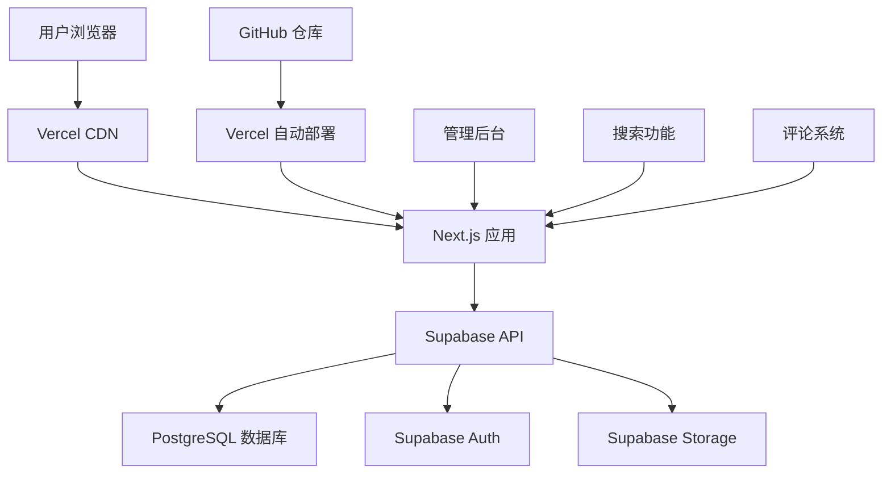

# Buzz Blog 🚀

[](https://github.com/pecmens/buzz/stargazers)
[](https://github.com/pecmens/buzz/network)
[](https://github.com/pecmens/buzz/blob/main/LICENSE)
[](https://nextjs.org/)
[](https://supabase.io/)
[](https://www.typescriptlang.org/)
[](https://tailwindcss.com/)

> 🌟 **现代化全栈博客系统** - 为创作者打造的高性能、功能完整的博客平台

## ✨ 项目亮点

Buzz Blog 是一个采用最新技术栈构建的现代化博客系统，集成了完整的内容管理、用户交互和性能优化功能。无论你是技术博主、内容创作者还是企业，Buzz 都能为你提供专业级的博客解决方案。

### 🎯 为什么选择 Buzz？

- **🚀 极致性能** - 静态生成 + 图片懒加载，首屏加载 < 2s
- **🔍 智能搜索** - 全文搜索 + 关键词高亮 + 搜索建议
- **📱 完美适配** - 响应式设计，移动端体验优秀
- **🛡️ 企业级安全** - 权限控制 + 数据加密 + 行级安全
- **⚡ 开箱即用** - 5分钟部署，零配置启动

## 🌟 核心特性

### 📝 内容管理
- **Markdown 编辑器** - 实时预览 + 语法高亮
- **文章管理** - 草稿/发布状态 + 定时发布
- **分类标签** - 灵活的内容组织方式
- **媒体管理** - 图片上传 + 自动优化

### 🔐 用户系统
- **多种登录方式** - 邮箱/密码 + GitHub/Google 第三方登录
- **权限管理** - 管理员/编辑者/用户 三级权限
- **用户资料** - 个人信息 + 头像 + 个人简介

### 💬 互动功能
- **评论系统** - 嵌套回复 + 评论审核
- **搜索功能** - 全文搜索 + 高级筛选
- **统计分析** - 文章阅读量 + 用户行为分析

### 🎨 用户体验
- **响应式设计** - 完美适配所有设备
- **暗黑模式** - 护眼模式支持（规划中）
- **国际化** - 多语言支持（规划中）
- **PWA 支持** - 离线访问（规划中）

## 🏗️ 技术架构

### 前端技术栈
```
Next.js 14 (App Router) + TypeScript + Tailwind CSS
```

### 后端服务
```
Supabase (PostgreSQL + Auth + Storage + Edge Functions)
```

### 部署方案
```
Vercel (Frontend) + Supabase (Backend) + GitHub (CI/CD)
```

### 架构图


## 🚀 快速开始

### 环境要求
- Node.js 18.0+
- npm 或 yarn
- Git

### 1️⃣ 克隆项目
```bash
git clone https://github.com/pecmens/buzz.git
cd buzz
```

### 2️⃣ 安装依赖
```bash
npm install
# 或
yarn install
```

### 3️⃣ 配置环境变量
创建 `.env.local` 文件：
```env
# Supabase 配置
NEXT_PUBLIC_SUPABASE_URL=your_supabase_project_url
NEXT_PUBLIC_SUPABASE_ANON_KEY=your_supabase_anon_key
SUPABASE_SERVICE_ROLE_KEY=your_supabase_service_role_key

# 网站配置
NEXT_PUBLIC_SITE_URL=http://localhost:3000
```

### 4️⃣ 初始化数据库
在 Supabase 控制台执行 `supabase-init.sql` 脚本

### 5️⃣ 启动开发服务器
```bash
npm run dev
```

访问 `http://localhost:3000` 查看效果！

## 📁 项目结构

```
buzz/
├── app/                    # Next.js App Router 页面
│   ├── admin/             # 管理后台页面
│   ├── auth/              # 认证相关页面
│   ├── categories/        # 分类页面
│   ├── posts/             # 文章页面
│   ├── search/            # 搜索页面
│   └── tags/              # 标签页面
├── components/            # React 组件
│   ├── admin/             # 管理后台组件
│   └── ui/                # 通用 UI 组件
├── lib/                   # 工具函数和配置
│   ├── admin-*.ts         # 管理后台 API
│   ├── auth.ts            # 认证相关
│   ├── supabase.ts        # Supabase 客户端
│   └── utils.ts           # 工具函数
├── hooks/                 # 自定义 React Hooks
├── middleware.ts          # Next.js 中间件
├── next.config.js         # Next.js 配置
└── supabase-init.sql      # 数据库初始化脚本
```

## 🎮 功能演示

### 📊 管理后台
- **仪表板** - 数据统计 + 快速操作
- **文章管理** - 创建/编辑/发布/删除
- **分类标签** - 内容组织管理
- **评论审核** - 内容质量控制
- **用户管理** - 权限分配

### 🔍 搜索功能
- **实时搜索** - 输入即搜索
- **关键词高亮** - 搜索结果高亮显示
- **搜索建议** - 智能搜索提示
- **高级筛选** - 分类/日期/排序筛选

### 📱 响应式设计
- **移动端优化** - 触摸友好的交互
- **平板适配** - 中等屏幕完美显示
- **桌面端** - 大屏幕充分利用空间

## ⚡ 性能优化

### 🏃‍♂️ 加载性能
- **静态生成 (SSG)** - 构建时预渲染页面
- **增量静态再生 (ISR)** - 按需更新静态页面
- **图片懒加载** - 减少初始加载时间
- **代码分割** - 按需加载 JavaScript

### 🎯 SEO 优化
- **元数据优化** - 动态生成页面标题和描述
- **结构化数据** - 搜索引擎友好的数据格式
- **Sitemap 生成** - 自动生成站点地图
- **Open Graph** - 社交媒体分享优化

### 🔧 开发体验
- **TypeScript** - 类型安全 + 智能提示
- **ESLint + Prettier** - 代码规范 + 自动格式化
- **热重载** - 开发时实时预览
- **错误边界** - 优雅的错误处理

## 🛡️ 安全特性

### 🔐 认证安全
- **JWT Token** - 安全的用户认证
- **第三方登录** - GitHub/Google OAuth
- **密码加密** - bcrypt 哈希加密
- **会话管理** - 安全的会话控制

### 🛡️ 数据安全
- **行级安全 (RLS)** - 数据库级别的访问控制
- **输入验证** - 防止 SQL 注入和 XSS 攻击
- **CSRF 保护** - 跨站请求伪造防护
- **权限控制** - 基于角色的访问控制

## 📈 部署指南

### Vercel 部署（推荐）
1. 将代码推送到 GitHub
2. 在 Vercel 导入项目
3. 配置环境变量
4. 自动部署完成

### 自定义部署
```bash
# 构建项目
npm run build

# 启动生产服务器
npm start
```

## 🤝 贡献指南

我们欢迎所有形式的贡献！

### 如何贡献
1. Fork 项目
2. 创建功能分支 (`git checkout -b feature/AmazingFeature`)
3. 提交更改 (`git commit -m 'Add some AmazingFeature'`)
4. 推送到分支 (`git push origin feature/AmazingFeature`)
5. 创建 Pull Request

### 开发规范
- 遵循 TypeScript 类型规范
- 使用 ESLint + Prettier 格式化代码
- 编写清晰的提交信息
- 添加必要的测试用例

## 📄 许可证

本项目采用 MIT 许可证 - 查看 [LICENSE](LICENSE) 文件了解详情

## 🙏 致谢

感谢以下开源项目和服务：

- [Next.js](https://nextjs.org/) - React 全栈框架
- [Supabase](https://supabase.io/) - 开源 Firebase 替代方案
- [Tailwind CSS](https://tailwindcss.com/) - 实用优先的 CSS 框架
- [Vercel](https://vercel.com/) - 前端部署平台
- [TypeScript](https://www.typescriptlang.org/) - JavaScript 的超集

## 📞 联系我们

- **作者**: Erik (pecmens)
- **邮箱**: [your-email@example.com]
- **GitHub**: [@pecmens](https://github.com/pecmens)
- **项目地址**: [https://github.com/pecmens/buzz](https://github.com/pecmens/buzz)

---

<div align="center">

**⭐ 如果这个项目对你有帮助，请给它一个 Star！**

Made with ❤️ by [Erik](https://github.com/pecmens)

</div>
